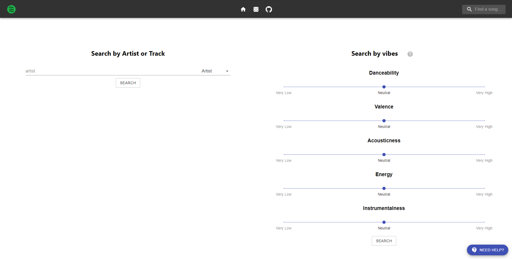
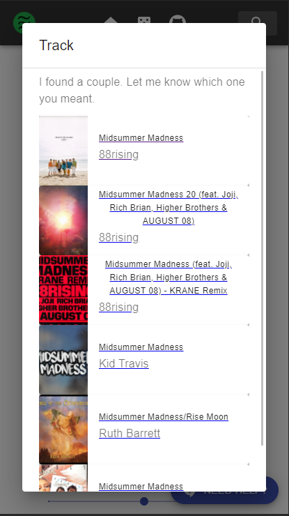
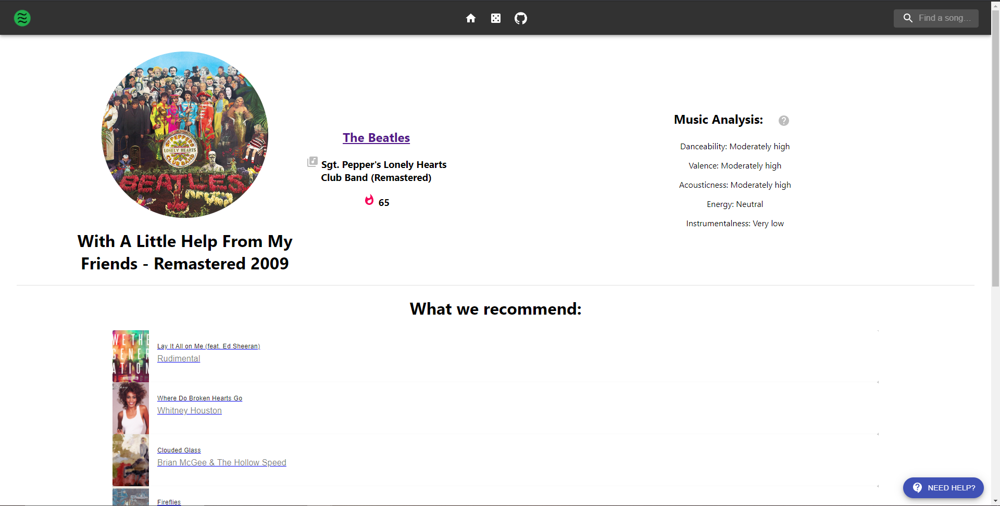
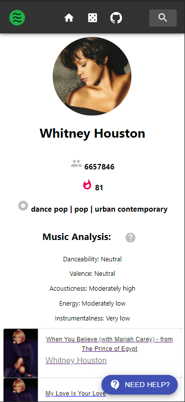

# Spot-A-Vibe!

Available here: https://spot-a-vibe.herokuapp.com

This project was made at HackBeanpot 2021 using the Spotify API. It is served using Gunicorn and the Heroku platform.
Backend: Flask, Python, MySQL (MariaDB)
Frontend: React, TypeScript 

For more information, the website has a learn more button 😉.

## Usage
Find similar Spotify songs and explore profiles of track and artists with Spot a Vibe!
The more people use our website, the better it can recommend.

## At a glance

### Homepage and Spot!

Spot is our handy helper asks a series of questions to ease users into finding the best recommendations possible. Inspired by my friend Ainslee!

### Track Profile Page

Every track on Spotify can be searched and analyzed. The track profile page displays its stats, popularity, details, and of course recommendations! The recommendations are based on the audio breakdown of the specified song.

### Artist Profile Page

Every artist on Spotify can be searched and analyzed as well! The artist profile page displays the audio breakdown of the artist's most well known songs, their popularity, genre, and links to their most popular songs.